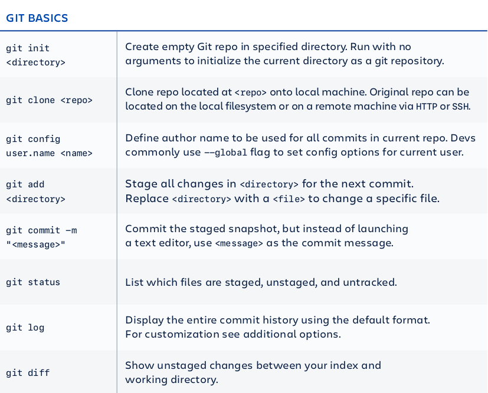

# Git

### Change User and Email on Global Level

```text
$ git config --global user.name "user name"  
$ git config --global user.email "test@test.com" 

# See changes
$ git config --list

```

Git Cheat Sheet

**Basic Git Command:**




## SSH Connection

Check on the computer: 

```bash
cd ~/.ssh
cd ~/.ssh/id_rsa
```


### VS Code always ask Username and Password

Using Visual Studio, when there is 




